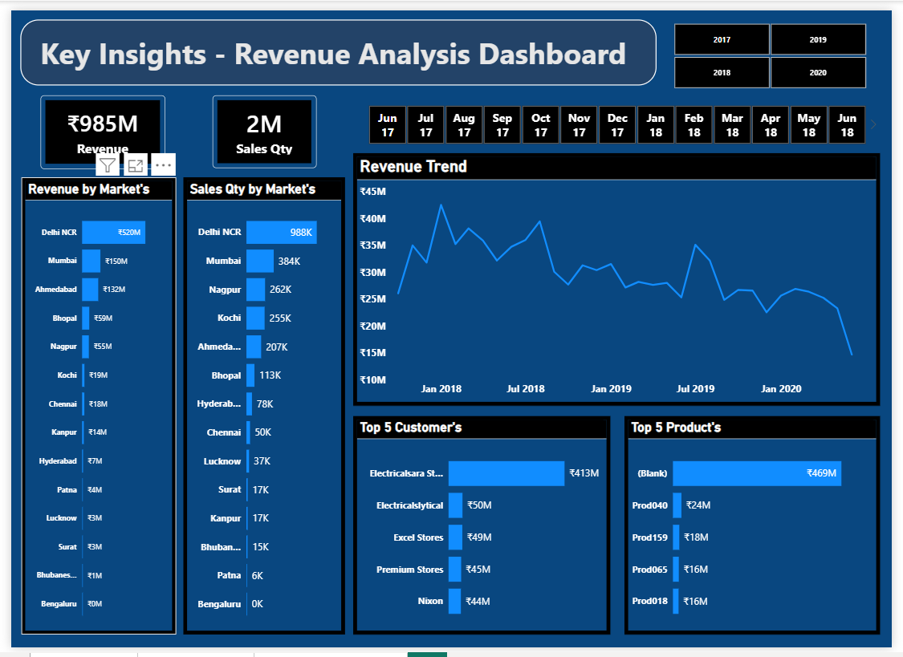

# 📊 Sales Insights - Data Analysis & Visualization Project

## 🔍 Project Overview

This project aims to provide data-driven insights to the Sales Director of "AtliQ Hardware," a company supplying computer hardware and peripherals to various clients. The company was facing challenges in tracking sales and understanding the declining revenue in a competitive market.

I built a comprehensive Sales Insights Dashboard to help the management make informed decisions by visualizing key performance indicators (KPIs) and sales trends.

---

## 📸 Dashboard Preview

---

## 🎯 Problem Statement

## 🎯 Objectives
- Analyze sales data to identify key trends
- Track revenue performance across markets
- Understand customer purchasing behavior
- Help business take data-driven decisions

---

## 🛠️ Tools & Technologies Used

* **MySQL**: For data storage and initial data exploration.
* **Power BI Desktop**: For ETL (Extract, Transform, Load) processes, data modeling, and creating interactive dashboards.
* **Power Query (DAX)**: To perform data cleaning and create calculated measures like Normalized Revenue and Total Profit.
* **SQL Queries**: To validate data and perform ad-hoc analysis.

---

## 📂 Dataset Description

The dataset consists of multiple tables:

* **customers**: Contains customer details (name, type)
* **transactions**: Contains sales transactions
* **date**: Date dimension table for time-based analysis
* **products**: Product-related information
* **markets**: Market/city information

---

## 🔍 Key Analysis Performed

* **Data Discovery**: Explored the `sales` database which includes tables like `customers`, `date, markets`, `products`, and `transactions`.
* **SQL Validation**: Ran various SQL queries to understand market-specific sales, distinct products, and revenue by year/month.
* **Data Cleaning (ETL)**:
  * Removed transactions with sales amounts less than or equal to 0.
  * Handled currency issues (converting USD to INR) to create a uniform `Normalized Amount` column.
  * Cleaned empty values and garbage characters in market names.
* **Data Modeling**: Created a Star Schema in Power BI by linking the transaction fact table with dimension tables (Date, Customer, Product, Market).
* **Dashboard Creation**: Designed 3 different views to track Revenue, Profit Margin, and Sales Quantity.

---

## 📊 Key Dashboard Features

* Total Revenue: **984.81M**
* Total Sales Quantity: **2M**
* Revenue trend over time
* Revenue by market (city-wise analysis)
* Sales quantity by market
* Top 5 customers
* Top 5 products
* Year and month filters (interactive slicers)

---

## 📈 Key Insights

* Delhi NCR generates the highest revenue (~519M)
* Sales show fluctuations with a declining trend in later years
* A few customers contribute a major portion of revenue
* Certain products dominate overall sales
* Some cities have very low contribution and can be targeted for growth

---

## 💼 Business Impact

* **Real-time Tracking**: The management no longer needs to rely on manual Excel reports from regional managers
* **Identify Weak Markets**: The dashboard highlights regions with declining profit margins, allowing the company to focus on specific improvement areas.
* **Customer Insights**: Identifies top customers and their contribution to total revenue, helping in targeted marketing strategies.
* **Profitability Analysis**: Enabled the company to see not just revenue, but the actual profit made after costs/discounts.

---

## 🚀 What I Learned

* How to connect Power BI with a MySQL database.
* Writing complex DAX formulas to create dynamic measures.
* Data cleaning techniques in Power Query to ensure data accuracy.
* How to translate business problems into visual data stories.
* Understanding the importance of "Normalized Revenue" in multi-currency transactions.

---

## ⚡ How to Run This Project

1. Import `db_dump.sql` into MySQL
2. Open Power BI file (.pbix)
3. Connect to database
4. Refresh data
5. Explore dashboard

---

## 🎥 Dashboard Demo
Video Demo: https://drive.google.com/file/d/1R_4gpTqpcnLCBtF9mXs6YUkqUGMXxS3-/view?usp=sharing

## 🔗 Project Link

GitHub: https://github.com/sanikakarche/Sales-Insights-Dashboard-Data-Analysis-Visualization

## 📌 Conclusion

This project demonstrates how raw data can be transformed into meaningful insights using SQL and Power BI. It highlights the importance of data visualization in business decision-making.

---

## 🔗 Author 
**Name:** Sanika Karche 
**Email:** sanikakarche7@gmail.com
**LinkedIn:** (https://www.linkedin.com/in/sanika-karche)

---

